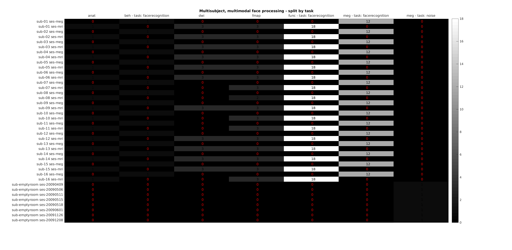

Word count: `r wordcountaddin::word_count()`

# Summary

The brain imaging data structure (BIDS) [@gorgolewski_brain_2016]
is becoming the standard for organizing "neuroimaging" data.

BIDS-matlab aims at centralizing MATLAB/Octave tools to interact with BIDS datasets.

# Statement of need

The brain imaging data structure (BIDS) [@gorgolewski_brain_2016]
is becoming the standard for organizing data in neuroscience
for several types of imaging modalites
(magnetic resonance imaging, positron emission tomography, microscopy...).

There currently is a python package (pybids, @yarkoni_pybids_2019)
that "includes virtually any functionality that is likely to be of general use
when working with BIDS datasets (i.e., that is not specific to one narrow context)".

<!-- Menton ANCPBIDS -->

There are also several MATLAB toolboxes (EEGlab `REF_NEEDED`, CONN toolbox `REF_NEEDED`)
have some BIDS support, at least to the extend that they can ingest
raw and/or derivatives BIDS datasets.

<!-- Resting state tooboxes -->

But there is no common library that, independently of the imaging modality:
- can index and query data and metadata BIDS dataset (whether they are raw or derivatives datasets)
- helps easily create filenames that follow a BIDS pattern
- can interact with the BIDS schema
- implements several of transformers to help using the BIDS statistical models
- can work for both MATLAB and Octave.

BIDS-matlab aims to fill that gap.


# Features

At the moment of the writing of this article, BIDS-matlab has the main following features.

## Indexing and querying datasets

When a dataset has several dozens of participants with heterogeneous content
in terms of imaging modality or acquisition parameters and
with metadata for even a single data file potentially spread across several JSON files,
it can become difficult to fetch the right file or piece of metadata.

BIDS-matlab can:

- return the layout of a BIDS dataset (`bids.layout`),

- perform queries on that layout to get information about the subjects,
  sessions, runs, modalities, metadata... contained within that dataset (`bids.query`).

BIDS-matlab is able to parse files in a BIDS datasets whether they follow the BIDS schema
or not, but require that they follow typical BIDS filenaming patterns (like those
generated by fMRIprep [@esteban_fmriprep_2019] -
see [next section](#creating-bids-valid-filenames) for more details).

One notable extension was made to this filename parsing rule to accommodate filenames
that include a prefix before the standard BIDS filename
(for example `swuasub-01_task-rest_bold.nii` with the prefix `swua`)
as prefixing is such a common way to deal with derivatives filenames.

## Creating BIDS valid filenames

Most files in a BIDS dataset follow a standard naming convention that can be summarised as follow:

```bash
datatype/sub-subLabel(_entity-label)*_suffix\.ext
```
<!-- test pseudo regex above and add link and example  -->

As of this writing, the BIDS specification supports:

- 12 datatypes (for example: `func`, `anat`, `eeg`...)
- 28 different entities (for example: `ses`, `task`, `acq`...)
- 103 suffixes (for example: `bold`, `T1w`, `events`...)

BIDS has a strict set of rules regarding:
- which suffix and entities are allowed for each datatype,
- which entities are allowed for raw and derivatives data,
- which entities are required or optional for each datatype and suffix,
- which order entities should appear in a filename.

Creating BIDS valid filenames can therefore become a tedious task.
BIDS-matlab `bids.File` class can help by relying on the BIDS schema
to validate filenames upon creation.

## transformers


## Dataset summaries

- generate a human readable report of the content of BIDS data set containing
  anatomical MRI, functional MRI, diffusion weighted imaging, field map data
  (see `bids.report`)

- create summary figures listing the number of files for each subject / session and
  and imaging modality (see `bids.diagnostic`)

{ width=100% }

- access and query the [BIDS schema](https://bids-specification.readthedocs.io/en/latest/schema.json) (`bids.schema`)

- access, query and create basic transformations for the [BIDS statistical model](https://bids-standard.github.io/stats-models/) (`bids.Model` and `bids.transformers`)

The behavior of this toolbox assumes that it is interacting with a valid BIDS
dataset that should have been validated using
[BIDS-validator](https://bids-standard.github.io/bids-validator/).

## Usage

According to a recent survey of 283 scientist [@paret_survey_2022],
7% of the 101 ones that had used BIDS before had also used BIDS-matlab.

BIDS-matlab is currently used in ASL explore [@mutsaerts_exploreasl_2020] and BIDSpm [@BIDSpm].

## Performance

## Development

- linting
- testing
- pre-commit

# Acknowledgements

# References
