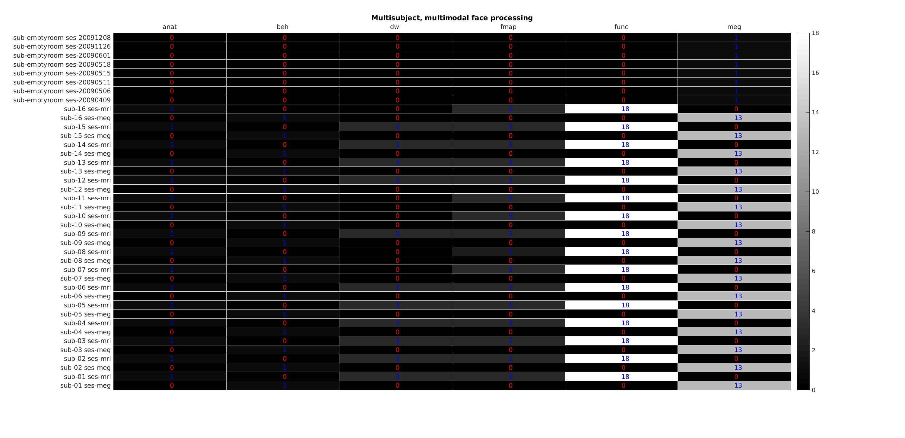

Function description
********************

.. automodule:: +bids

.. autofunction:: derivatives_json

.. autofunction:: init

.. autoclass:: Description
    :members:

.. autofunction:: copy_to_derivative

.. autofunction:: report
.. autofunction:: validate

.. autofunction:: diagnostic

.. _fig_diagnostic:

   output of ``diagnostic``

.. _fig_diagnostic_events:

   output of ``diagnostic`` for events

.. _fig_diagnostic_task:
.. figure::  ../images/MultisubjectMultimodalFaceProcessing_splitby-task.png
   :align:   center

   output of ``diagnostic`` split by task
