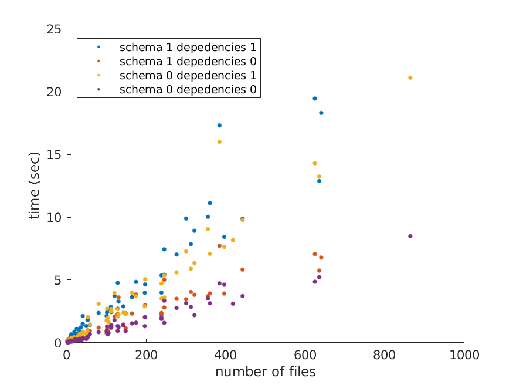

Performance
***********

bids-matlab's performance may vary
depending on which options you choose for indexing with :func:`bids.layout`.

Relying on the BIDS schema (``'use_schema', true``) to only include files that comply with it
may slow down performance a bit.

Index dependencies (``'index_dependencies', true``) to detect files
with explicit dependencies between them
(for example when a fieldmap mentions that is intended for a specific bold run)
is much slower and you may consider setting this to ``false``
when if you know that you have no such dependencies in your dataset.

.. _fig_benchmark:

   layout indexing performance depending on chosen options
