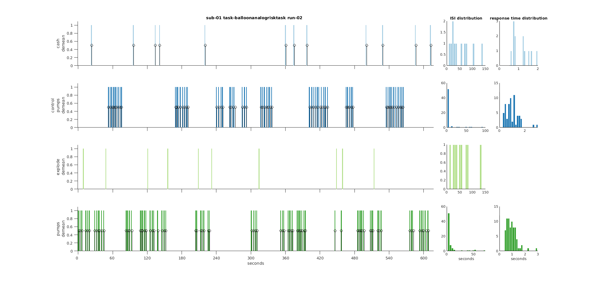

Utility functions
*****************

.. automodule:: +bids.+util

.. autofunction:: create_data_dict
.. autofunction:: create_participants_tsv
.. autofunction:: create_readme
.. autofunction:: create_scans_tsv
.. autofunction:: create_sessions_tsv
.. autofunction:: download_ds
.. autofunction:: jsondecode
.. autofunction:: jsonencode
.. autofunction:: mkdir
.. autofunction:: plot_events

.. _fig_diagsnotic:

   output of ``plot_events``

.. autofunction:: tsvread
.. autofunction:: tsvwrite
